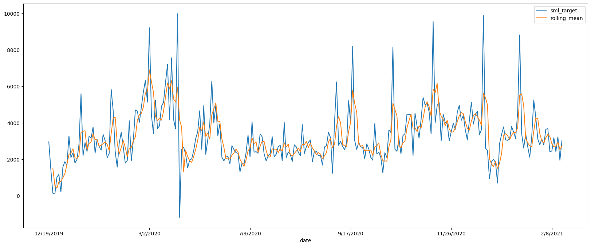
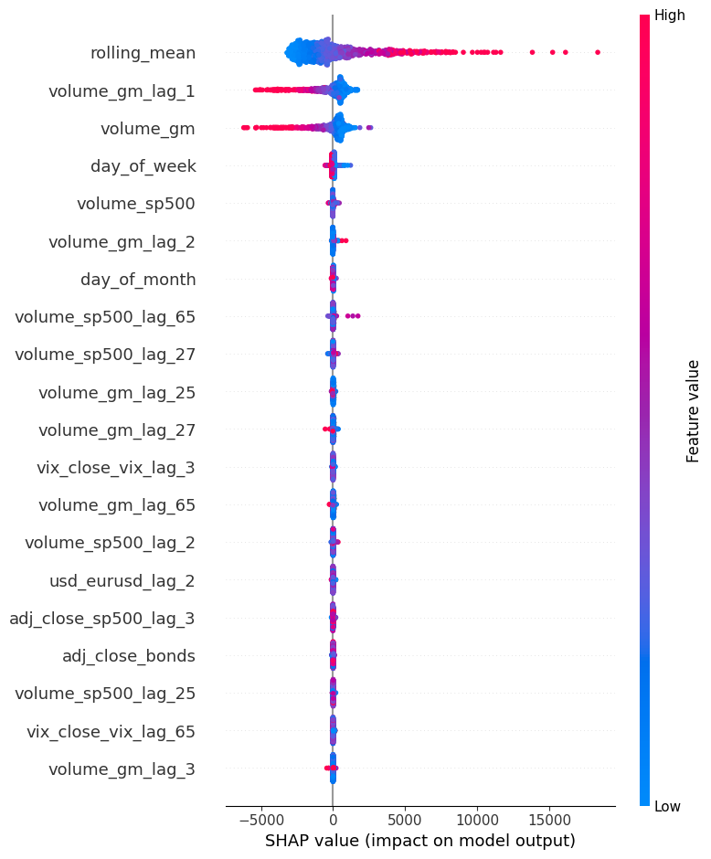
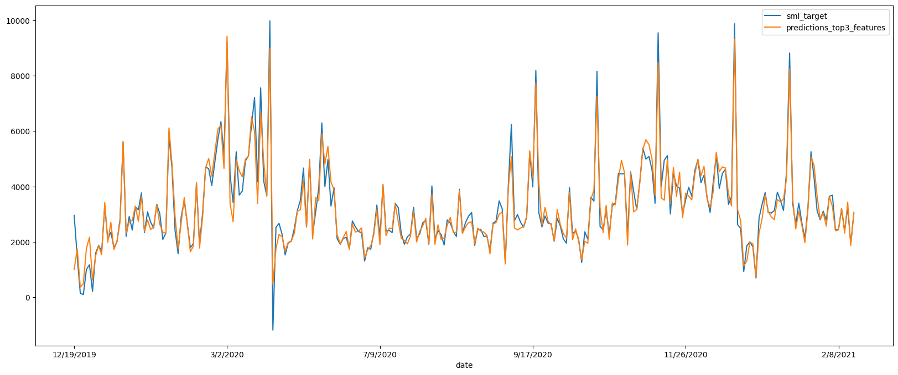

<!--
theme: gaia
paginate: true
-->
<!-- _class: lead -->

# Global Markets Volume Forecast
Patricia Alejandra

---

## The problem:
The Global Markets Management Team (MT) wants you to forecast the volumes that goes through Global Markets systems.

**The Global Markets MT is interested in a prediction of the volume of the next day (t+1).**


## The assignment:
Develop a working prototype of a model that predicts these t+1 volumes.


___

## Approach:
1. 🤓 Research
2. 📊 EDA
3. 👩🏾‍💻 Create baseline model
4. 👩🏾‍💻 Experiment with different modeling and feature engineering techniques.
5. 🆚 Evaluate againts baseline model.
4. 😉 Deploy winner 
5. 📈 Demo

---

### 1. Research results
- Treat it as a (uni/multi)variate time series forecast problem,
    - Stationarity is prefered
- Use traditional supervised ML
- LSTM*

### Conclusions
- Use supervised ML

---

### 2. EDA results
- There are incorrect* values in the global markets data source.
- There are missing values in the external data sources.
- Bonds volumes data is not useful as it is just 0.
- The global markets volumes is weakly* autocorrelated.
- S&P volumes, SP& price, VIX, and EUR-USD are highly autocorrelated.
- Gold price and S&P price have a clear ascending trend.
- Gold volumes have a seasonality of 2 months.

---
### 2. EDA results (cont.)

- EUR-USD exchange rate does not vary that much over time.
- VIX and GM volme have a similar distribution.
- Temporal features (day of the week, day of the month, month) seem not to influence volumes.
- Most trade happens when VIX is small (ties to VIX definition)

```
notebooks/1-eda.ipynb
```

---
### 3. Feature Engineering
- Add target based on volumes data:
```
df["target"] = df["volume_gm"].shift(-1)
```
- Remove incorrect values.
- Split train and test by date:
     - train: ('1/4/2016', '12/18/2019')
     - test: ('12/19/2019', '2/15/2021')

---
### 3. Feature Engineering (cont.)
- Interpolate to deal with NaN values.
- Cap outliers (with mean and std from train set).
- Add target rolling mean.
```
df["rolling_mean"] = df[target_column].rolling(window=3).mean()
```
- Add lags
```
df[feature_col_name] = df.shift(lag)[col]
```

---
### 4. Baseline Model
Rolling mean with window=3.
```
MAE: 714.2344719120734
RMSE: 1050.5203311945409
R2: 0.5515357225331949
```



---
### 5. Modelling: Feature Importance



SHAP Values

- External information and temporal features have little to no importance compared with the target rolling_mean, and current and previous volumes.

---
### 6. Model
Pipeline definition after RandomSearchCV

```
preprocessor = Pipeline(
    steps=[
        ("scaler", MinMaxScaler()),
    ]
)
xgb_model = xgb.XGBRegressor(
    eval_metric=root_mean_squared_error,
    learning_rate=0.2,
    max_depth=5,
    subsample=0.8,
    random_state=42,
)
pipeline = Pipeline(steps=[("preprocessor", preprocessor), ("model", xgb_model)])
```

---
### 6. Model: Results
Test Set
```
MAE: 261.9476624860748
RMSE: 389.19885478968047
R2: 0.9382964501157846
```




---
<!-- _class: lead -->
# DEMO

---
### Deployment recommendation
